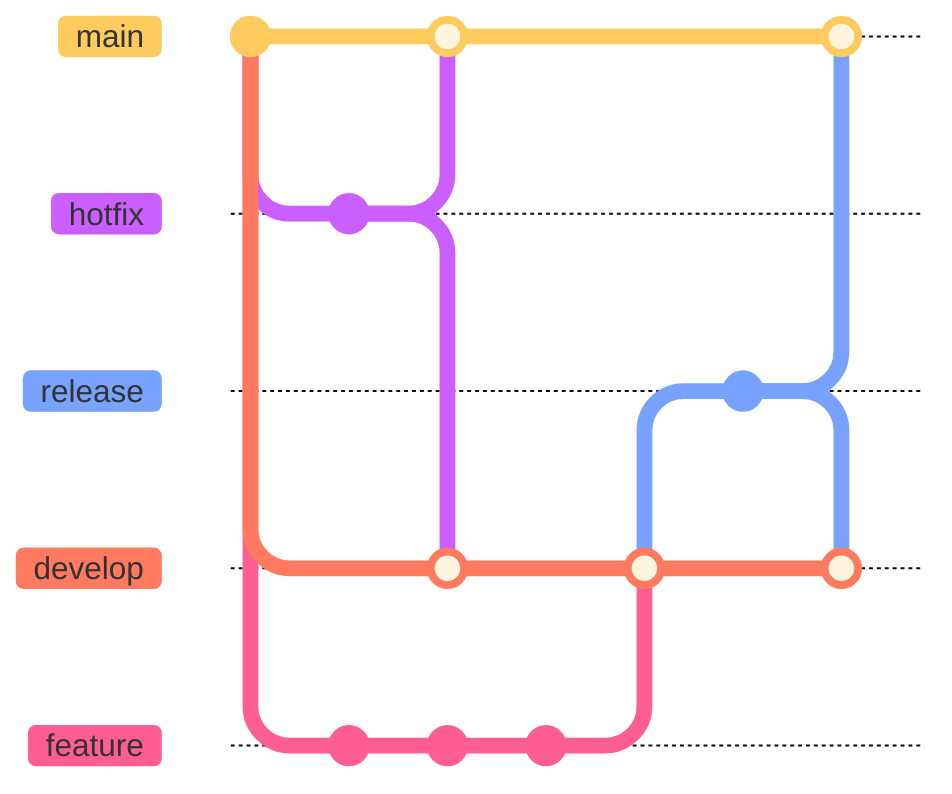

```mermaid
%%{init: { 'logLevel': 'debug', 'theme': 'base', 'gitGraph': {'parallelCommits': true ,'showCommitLabel': false} } }%%
      gitGraph LR:
        commit
        branch hotfix
        branch develop order: 1
        checkout develop
        branch feature order: 2
        commit
        checkout main
        checkout hotfix
        commit type:NORMAL
        checkout main
        merge hotfix
        checkout feature
        commit
        checkout develop
        merge hotfix
        checkout feature
        commit
        checkout develop
        merge feature
        branch release
        commit
        checkout main
        merge release
        checkout develop
        merge release
```